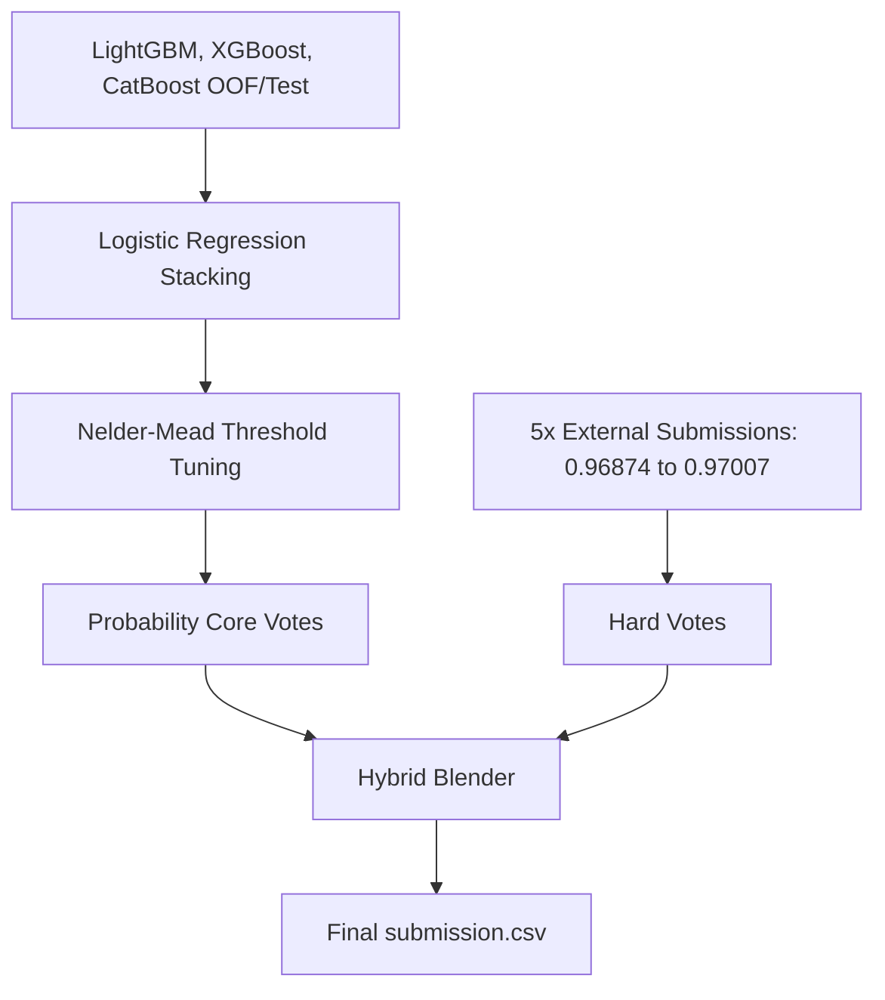

# Stacking-Assisted Blender Design Specification

**Date**: 2026-06-03  
**Status**: APPROVED  
**Goal**: Combine high-scoring external submissions with our locally-optimized probability stacking meta-learner to maximize the Balanced Accuracy score.

---

## 1. Architectural Overview

We implement a two-layer hybrid ensembling pipeline in **[03_model_tuning_and_ensemble.ipynb](file:///Users/tuanm.nguyen/Documents/kaggle-s6e6-predicting-stellar-class/notebooks/03_model_tuning_and_ensemble.ipynb)**:



### Unanimous vs. Disagreement Regions
* **Unanimous (98.5% of test rows)**: If all 5 external submissions agree on a class label, we output that label directly.
* **Disagreement (1.5% of test rows)**: If there is any discrepancy, the tie is broken by a weighted vote:
  $$\text{Votes}_c = \sum_{j=1}^{5} W_j \cdot \mathbb{I}(L_j = c) + \text{CORE\_WEIGHT} \cdot P_{\text{stacked}, c}$$
  where:
  * $W_j$ is the public leaderboard score of submission $j$ (serving as its weight).
  * $L_j$ is the class label predicted by submission $j$.
  * $P_{\text{stacked}, c}$ is our stacked prediction probability for class $c$.
  * $\text{CORE\_WEIGHT}$ equals $\sum_{j=1}^5 W_j$, giving our locally-optimized models a weight equal to the entire external panel.

---

## 2. Directory Resolution & Configurations

We add the dataset source to `notebooks/kernel-metadata.json`:
* **Dataset source**: `flexonafft/stellar-data`
* **Path resolution**:
  ```python
  if ON_KAGGLE:
      SUBS_DIR = Path('/kaggle/input/stellar-data/external/submissions')
  else:
      SUBS_DIR = Path('scratch/external/submissions')
  ```

---

## 3. Data Transformations & Merging Pipeline

1. **Load External Submissions**: Scan `SUBS_DIR` for `.csv` files. Parse filenames as weights. Align all rows on `id`.
2. **Train Stacker & Calibrate Multipliers**:
   * Stacker: `LogisticRegression(class_weight='balanced')` trained on base models' OOF probabilities via 5-fold CV to generate `meta_oof`.
   * Multipliers: Nelder-Mead optimization on `meta_oof` with a barrier penalty for weights $\le 0.01$ to generate `best_thresholds`.
3. **Assemble Final Predictions**:
   ```python
   # Initialize votes array
   votes = np.zeros((num_test_samples, 3))
   
   # Add external weights
   for j in range(5):
       np.add.at(votes, (np.arange(num_test_samples), L[:, j]), W[j])
       
   # Add probability core
   votes += CORE_WEIGHT * stacked_test_prob
   
   # Scale votes by best thresholds prior to argmax
   scaled_votes = votes * best_thresholds
   final_preds = np.argmax(scaled_votes, axis=1)
   ```

---

## 4. Verification Plan

* **Local Validation**: Ensure `notebooks/03_model_tuning_and_ensemble.ipynb` remains valid JSON.
* **Execution Validation**: Pushing the kernel to Kaggle and checking logs to verify that the disagreement region is detected, ensembling succeeds, and outputs are written without errors.
